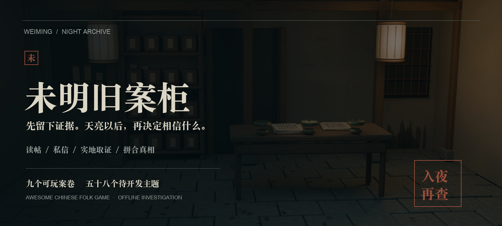
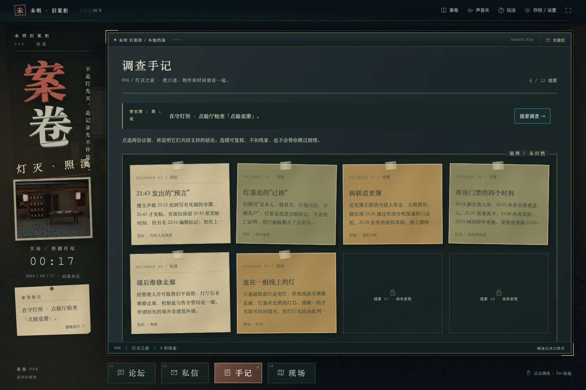
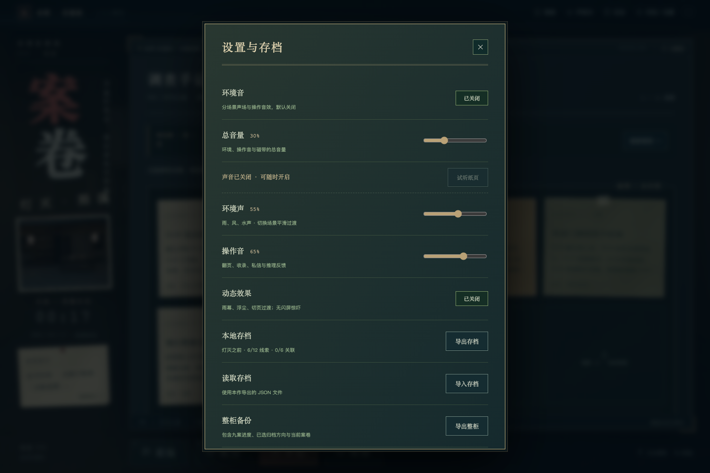
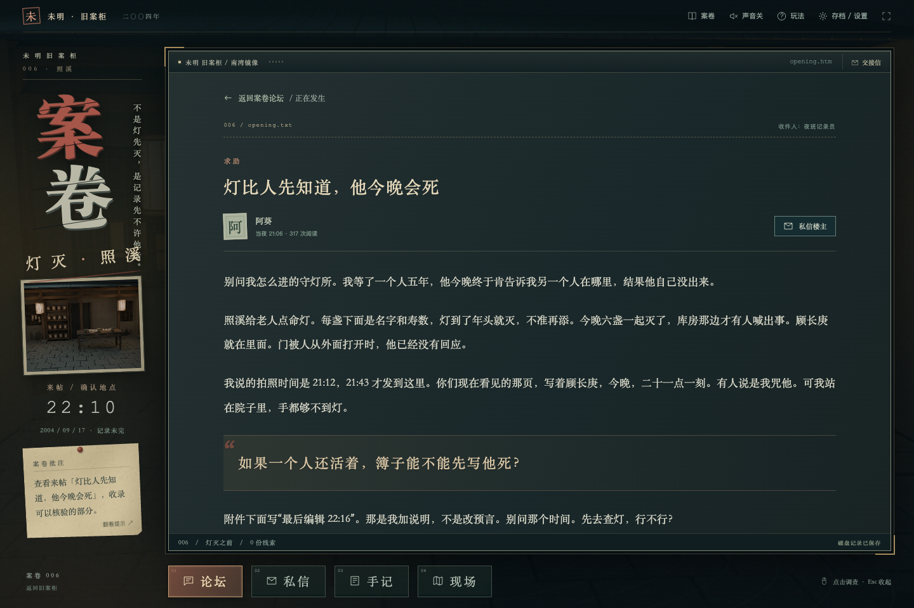
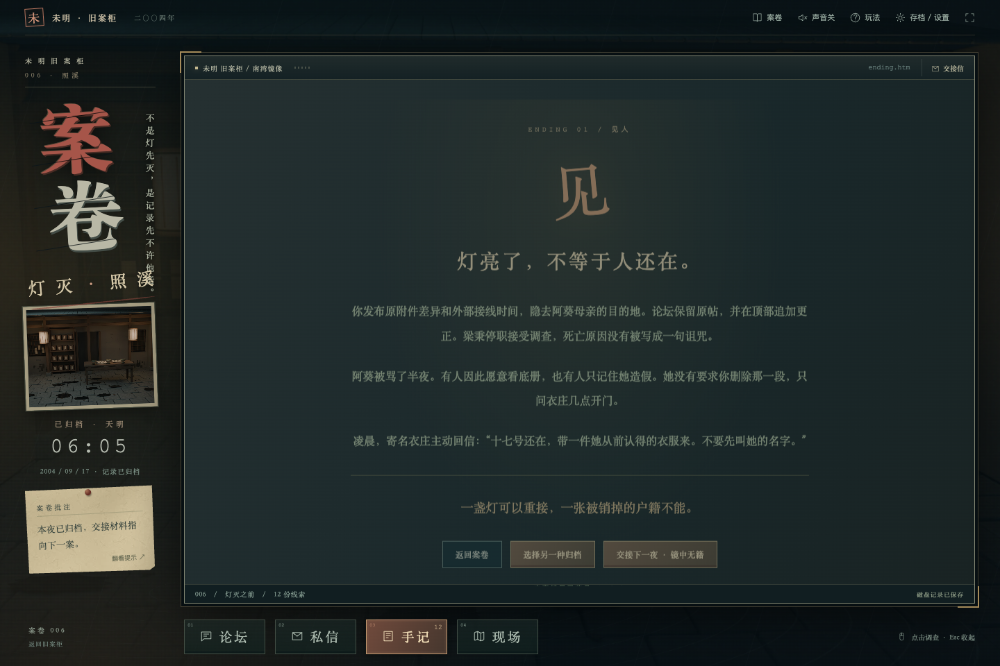

<div align="center">

# Awesome Chinese Folk Game
### 未明旧案柜 · 入夜，再查

**完全开源 × 论坛推理游戏 × 可扩展民俗悬疑资料库**  
**📦 零依赖 · 🎭 9 个完整案卷 · 📖 58 个储备主题 · 🔒 纯本地运行**

[](LICENSE)
[](LICENSE)
[](requirements.txt)
[](docs/case_list.md)


[快速开始](#-快速开始) · [完整案卷目录](docs/case_list.md) · [玩法手册](docs/game_manual.md) · [English](#english)





</div>

> 放下去六盏，飘回来七盏。  
> 有人在一张被裁掉的报纸里，等了六年。

这不是一张游戏宣传页。你会真正进入帖子、留下追问、私信相关人，走进线索指向的现场，再把互相矛盾的材料拼回同一个夜晚。我们不替传闻作证，先替没能留下名字的人保管证据。

---

## 🎮直接开始玩（Bilibili Toy）
٩(๑>◡<๑)۶ 这个游戏已经在bilibili toy发布
可以线上开始玩：👉 [午夜论坛*未明旧案](https://www.bilibili.com/toy/weiming-jiuan/index.html)

٩(๑>◡<๑)۶ B站游戏链接：
https://www.bilibili.com/toy/weiming-jiuan/index.html?spm_id_from=333.40252.my_toys.toy_card.click


---


## ✨ 这是什么？

**未明旧案柜** 是一个**离线、无依赖、纯本地**的中文民俗悬疑推理游戏。

你扮演一个深夜论坛的调查员——读帖、私信核验、实地搜证、配对证据、写出推理报告。每个案卷是一个完整的民俗谜案：河灯、阴亲、旧镜、封井、归宗……你做的不是"选 A 还是 B"的视觉小说，而是真正的调查。

**和别人有什么不一样？**

| | 普通文字游戏 | 未明旧案柜 |
|---|---|---|
| 体验方式 | 线性读故事 | 论坛模拟：读帖、私信、实地搜证 |
| 谜题设计 | 选项即答案 | 必须**说明**两份证据支持什么推断，误判有反馈 |
| 内容规模 | 1 个故事 | **9 个可玩案卷**（含 4 夜连续主线）+ 58 个写作储备 |
| 运行方式 | 需下载安装 | **双击 HTML 或一行 Python 命令**，无需 pip |
| 隐私 | 联网、账号 | **零追踪、零账号、零后端**，存档只在你浏览器里 |
| 内容保障 | 无校验 | 每个案卷自动做**线索可达性 BFS 校验**，保证所有线索可解锁 |

## 📂 九个可玩案卷

| 案号 | 案卷 | 主题 | 类型 |
|:---:|---|---|:---:|
| 001 | **借灯人** | 河灯、旧闻、被漏记的人 | 独立旧案 |
| 002 | **空轿照夜** | 阴亲与古宅 | 独立旧案 |
| 003 | **铃过无名关** | 归乡路引与身份 | 独立旧案 |
| 004 | **年夜缺席** | 守岁与空席 | 独立旧案 |
| 005 | **最后一折** | 水乡阴戏与旧事 | 独立旧案 |
| 006 | **灯灭之前** | 命灯、隔墙听声、被改写的死期 | 🔗 寄名簿·第一夜 |
| 007 | **镜中无籍** | 旧镜、寄名衣物、身份记录 | 🔗 寄名簿·第二夜 |
| 008 | **井底回邮** | 封井、镇石、一封信的真实邮路 | 🔗 寄名簿·第三夜 |
| 009 | **归宗空席** | 归宗、层叠封存、更正与授权 | 🔗 寄名簿·第四夜 |

《寄名簿》每夜 **8 篇帖子 / 12 份线索 / 6 条解释 / 2 处现场 / 1 个谜题 / 2 种归档方向**，后续案随前案归档开放。

📖 **完整目录**：[case_list.md](docs/case_list.md) · 机器可读：[catalog.json](cases/catalog.json)

---

## 📚 58 个民俗主题储备

除了 9 个已完成案卷，仓库还附带 **58 个结构化民俗主题写作储备**（不是 58 个可玩游戏）：

- **传统民俗参考**（28 篇）：阴亲、赶尸、风水、阴戏、狐仙、童谣……
- **新收集参考**（30 篇）：命灯、寄名、古镜、封井、夜巡、归宗……

每篇包含：民俗设定、现场疑点、关键线索、拼图逻辑、折叠反转、玩法衔接建议和开发风险。**这是剧本创作的起点，不是现成的游戏。**

---

## 🎬 快速开始

### 方式一：一行命令（推荐）

```sh
git clone https://github.com/momozi1996/awesome-chinese-folk-game.git
cd awesome-chinese-folk-game
python3 demo/run_demo.py
```

浏览器自动打开 **http://127.0.0.1:4173/**，开始调查。

> **不需要 pip install，不需要账号，不需要 API Key。** Python 3.9+ 标准库即可。

### 方式二：免 Python

直接用浏览器打开 **`src/forum_system/index.html`**，保留完整 `src/` 目录即可离线玩。

### 方式三：无 git

从 [releases](../../releases) 下载最新 zip，解压后运行上面的命令。

**第一次玩？** 从《借灯人》的求助帖开始。想进入连续故事？顶栏 **案卷 → 寄名簿 → 灯灭之前**。

<sub>🎮 每案 35–50 分钟（创作估算）。建议耳机、夜晚、灯光调暗。16+ 内容。</sub>

---
## 🖥️ 游戏界面


<p align="center"><em>褪色朱砂的旧论坛首页</em></p>


<p align="center"><em>实地搜证 · 十二幅 1920×1200 预渲染夜景现场</em></p>



<p align="center"><em>证据手记 · 配对线索并写出推理</em></p>


<p align="center"><em>私信核验 · 追问当事人，辨别真伪</em></p>


<p align="center"><em>连续案卷《寄名簿》· 四夜交叉</em></p>



<p align="center"><em>分场景声场 · 细雨、漏风、井院水滴、雪夜风声</em></p>

<details>
<summary>📷 查看更多截图（含剧透）</summary>






</details>

---

## 🎮 调查循环

```
读帖 → 标记证据 → 私信核验 → 实地取证 → 配对并解释 → 回访复勘 → 报告归档
```

- **续帖和现场由证据解锁**，不是一屏全部摊开的素材
- **推理必须说理由**：配对两份材料后要说明它们支持什么推断，误判有反馈
- **时间、镜位、邮路、授权各用不同核验方式**，不是每案都一把密码锁
- **公开或暂缓公开**影响下一夜的交接，两条路径都可继续


<sub>GIF 为真实操作节选，省略阅读与等待时间。</sub>

---


## 🛠️ 给开发者的技术亮点

### 零依赖、纯逻辑引擎

游戏引擎是一个 **37 行的纯函数 UMD 模块**，不碰 DOM、不碰 localStorage：

```js
// src/case_engine/engine.js — 核心推理判定
function inferenceCorrect(link, selected, state) {
  return !!link?.inference
    && link.pair.every(id => state.clues.includes(id))  // 两份证据都已发现
    && selected === link.inference.answer;               // 且推断方向正确
}
```

正因为如此，**浏览器和 Node 跑同一套测试**：

```sh
python3 -m unittest discover -s tests   # 12 个 Python 单测
node tests/engine.cjs                   # 2 个 JS 引擎测试
python3 main.py --check                 # 内容库校验
```

### 内容即数据，自动编译校验

你只需要写 Markdown + JSON，`folk_parser` 会自动：

1. **解析 frontmatter**（只接受标量 key:value，拒绝重复 key）
2. **BFS 线索可达性分析**——确保每个线索都能被玩家解锁，不会出现死胡同
3. **连续案卷双向校验**——`previousCase` 和 `nextCase` 必须互相对得上
4. **路径穿越防护**——资产路径做 `resolve()` 后检查是否在目录内
5. **编译成离线快照**——`data.js` 自动生成，前端零请求

```sh
python3 -m src.folk_parser check    # 只校验，不改文件
python3 -m src.folk_parser build    # 编译离线数据 + 目录
```

### 服务器安全意识

```python
# src/utils/server.py — 默认绑回环，白名单暴露
parser.add_argument('--host', default='127.0.0.1')  # 不对外暴露
# 路径穿越防护：拒绝 . 和 ..，resolve 后检查父目录
# 目录列表禁用 + nosniff 头 + no-cache
```

### 架构一览

```
纯 Python 标准库 + 原生 JS/CSS · 无框架 · 无 CDN · 无数据库

src/
├── forum_system/      # 前端 UI（1603 行 JS + 4090 行 CSS）
├── case_engine/       # 纯逻辑引擎（UMD，浏览器/Node 双端）
├── folk_parser/       # 内容编译 + 严格校验
└── utils/              # 本地服务器（回环优先）

cases/
├── classic-folk-cases/  # 28 篇传统民俗参考
├── exclusive-folk-cases/ # 30 篇新收集参考
└── playable/           # 9 个可玩案卷 JSON
```

---

## 🗺️ 路线图

- [x] V1 初版论坛原型
- [x] V3 独立旧案
- [x] V4《寄名簿》连续四案主线
- [x] V5 视听更新（预渲染场景 + 分场景声场）
- [ ] V6 更多独立案卷（从 58 个储备中选取）
- [ ] 贡献者友好的剧本模板
- [ ] 无障碍改进（屏幕阅读器支持）

---

## 🤝 贡献

欢迎一切形式的贡献：

- **写新案卷**：从 58 个储备主题中选一个，按 [剧本库说明](cases/README.md) 的格式提交 PR
- **修 bug / 优化**：先跑测试确认不回归，再提 PR
- **改进文档 / 翻译**：英文版目前较薄，欢迎完善
- **建议新主题**：开 Issue 聊聊你想玩什么民俗谜案

> 新增可玩本必须有独立的人物、时间线、伏笔、失败反馈和完整通关验证，不只是把参考条目改成 playable。

---

## 📄 许可

本项目采用 **双许可证**：

| 部分 | 许可证 | 你能做什么 |
|---|---|---|
| **代码**（`src/`、`tools/`、`tests/`） | [MIT](LICENSE) | 随便用、随便改、可商用 |
| **内容**（`cases/`、剧本、美术、音频） | [CC BY-NC-SA 4.0](LICENSE) | 可玩、可分享、可改编，**不可商用** |

完整条款见 [LICENSE](LICENSE)。商业合作请联系仓库作者。

---

## English

<details>
<summary>🇬🇧 Expand English version</summary>

### A playable investigation archive, not a landing page

**未明旧案柜 (Awesome Chinese Folk Game)** is an **offline, dependency-free, Chinese-language folk-horror investigation game**. Read forum threads, interview fictional users through private messages, examine scenes, connect evidence and explain your deductions before filing a report.

The repository contains **9 playable cases**: five standalone mysteries plus the four-part **Register of Borrowed Names** cycle. The separate **58-theme Markdown library** is a writing reference collection, **not 58 additional playable games**.

### Quick start

```sh
git clone https://github.com/momozi1996/awesome-chinese-folk-game.git
cd awesome-chinese-folk-game
python3 demo/run_demo.py
```

Python 3.9+, standard library only. No pip install, no account, no API key. For a server-free session, open `src/forum_system/index.html` directly.

### Why this project?

- **Zero dependencies, zero build step** — pure Python stdlib launcher + vanilla JS frontend
- **Content-validated by design** — every clue is reachable via BFS, every link pair is valid, serial progression has no broken references
- **Privacy-first** — saves stay in your browser localStorage, zero tracking, zero network requests
- **12 locally rendered scenes** at 1920×1200, with procedural Web Audio ambient soundscapes
- **Testable engine** — the case engine is a pure-function UMD module, runnable in both browser and Node

### License

Dual-licensed:
- **Code**: MIT
- **Content (stories, art, audio)**: CC BY-NC-SA 4.0

See [LICENSE](LICENSE) for details.

</details>

---

<div align="center">

<sub>放下去六盏，飘回来七盏。</sub>

</div>
